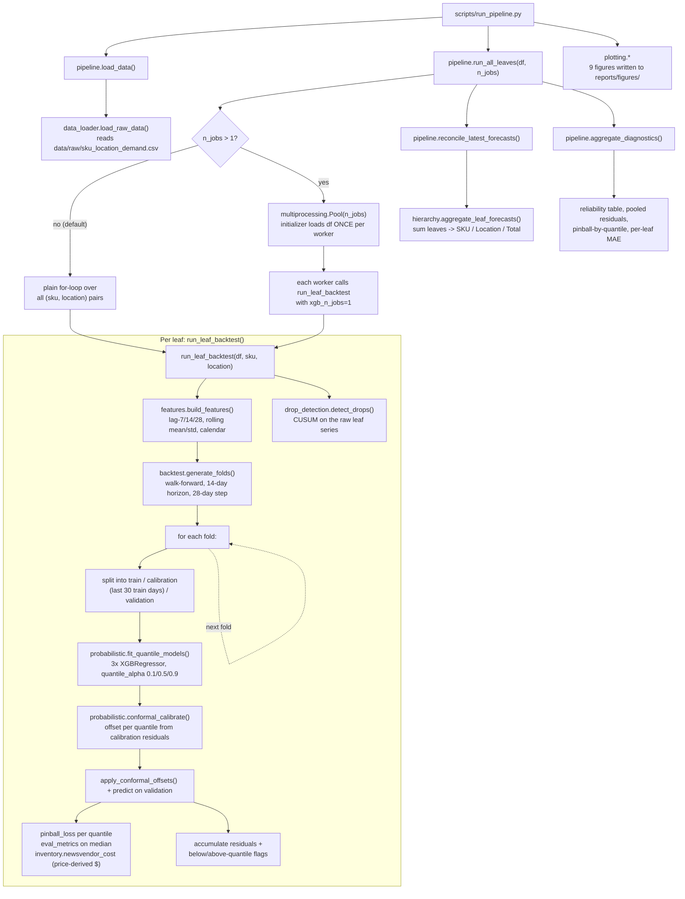
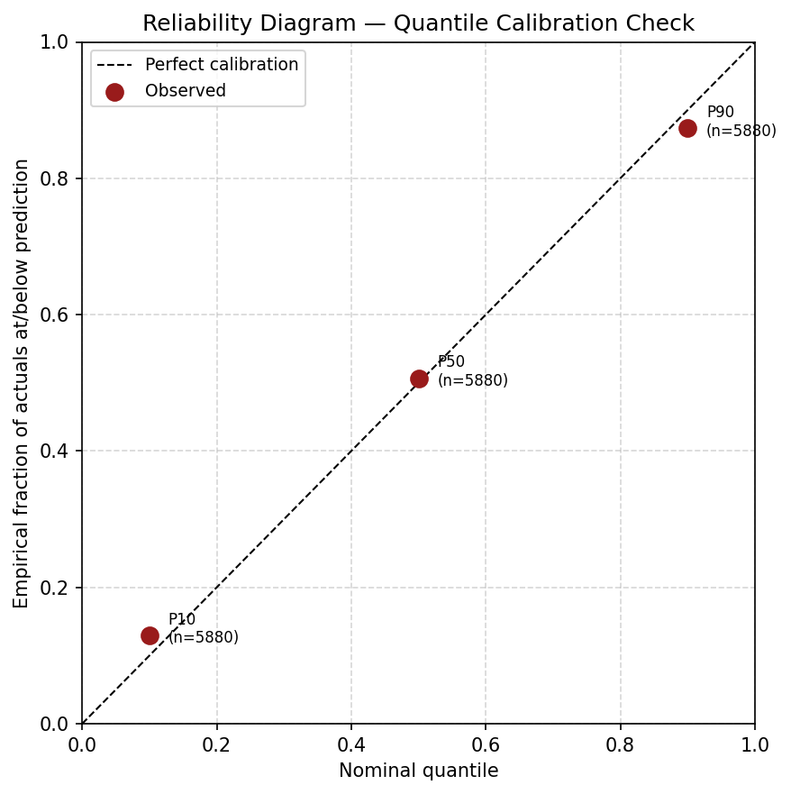
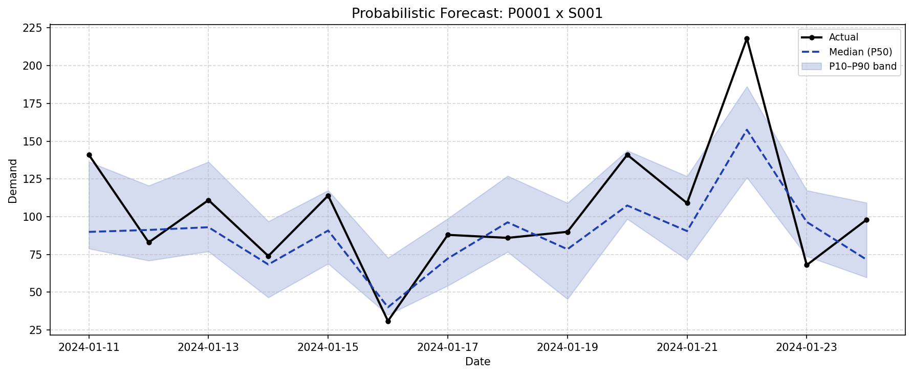
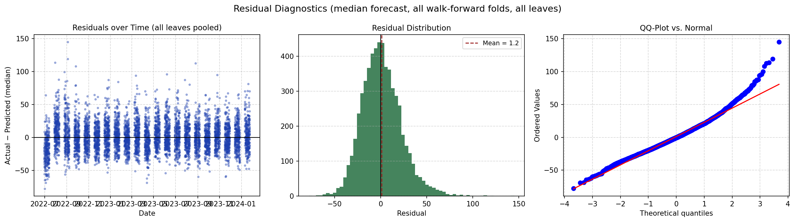
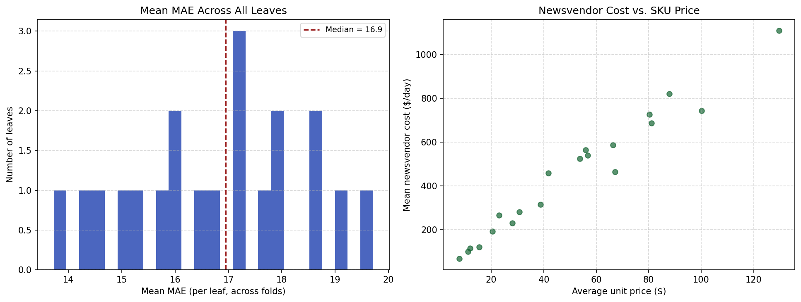
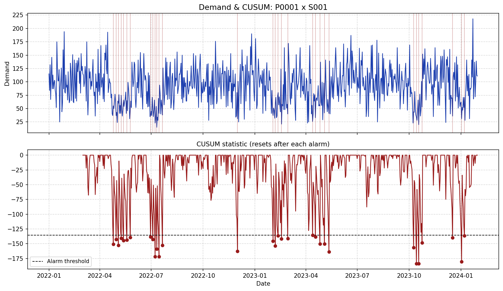
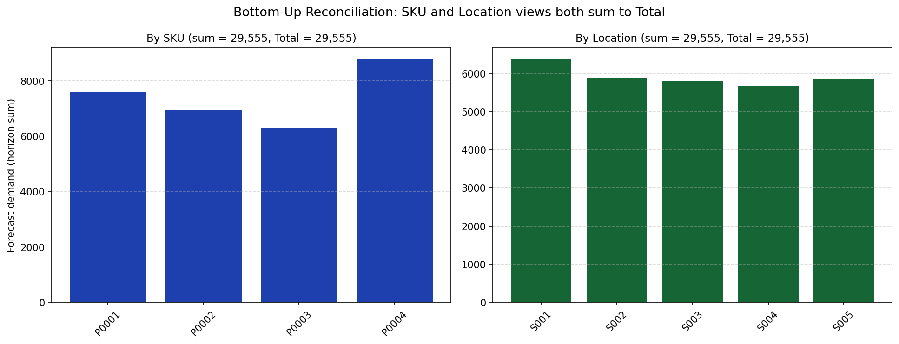
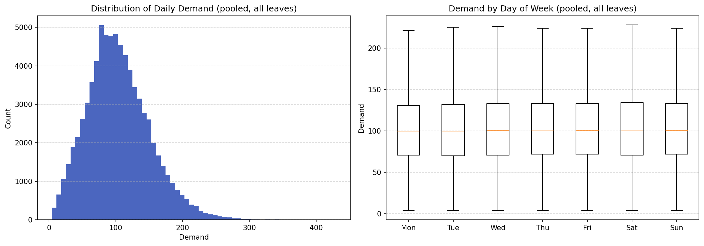
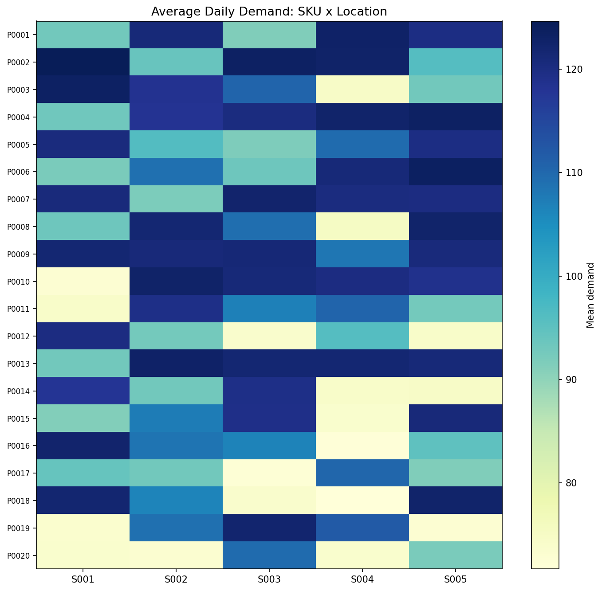

# SKU x Location Demand Forecasting

Most forecasting demos stop at "here's my MAE." This one tries to answer
the questions that actually matter once you're planning inventory: how
much buffer do I need, where are things breaking down, and can I trust
the uncertainty range the model is giving me — or is it just made up?

The pipeline forecasts demand per **SKU x Location** (not one big
aggregate series), reconciles those forecasts up to SKU-level,
Location-level, and Total views, and produces **P10/P50/P90** forecasts
instead of a single number — because "reorder point" is a question about
a distribution, not a point estimate.

## The approach, briefly

**Per-leaf forecasting + bottom-up reconciliation.** Every SKU at every
store gets its own model. Roll those up by summing, and every aggregate
view (by SKU, by Location, Total) is automatically consistent with the
leaf forecasts underneath it — no separate reconciliation step that can
introduce its own error. The trade-off (documented in `src/hierarchy.py`)
is that this doesn't borrow statistical strength across series the way
top-down or MinT reconciliation can — but for inventory decisions, the
leaf forecast is the thing you actually act on, so that's where the
accuracy needs to live.

**Quantile XGBoost, calibrated with conformal prediction.** Training an
XGBoost model with `quantile_alpha=0.9` doesn't guarantee that 90% of
outcomes actually fall below its prediction — it's just what the model
was told to aim for. Split conformal prediction adds a calibration step
on held-out data so the quantiles mean what they say. Whether it worked
is measured, not assumed — see the reliability diagram below.

**CUSUM instead of a fixed threshold for drop detection.** A rule like
"flag it if demand drops below 70% of average" only catches sudden
cliffs. It's blind to a slow bleed that never crosses the threshold on
any single day but adds up to a real problem over two weeks. CUSUM
accumulates small deviations and fires once they add up to something
statistically real — standard tool in process control, borrowed here for
demand monitoring.

**Costs derived from price, not made up.** The dataset has no "cost of a
stockout" column, so one is derived from each SKU's own price using
standard rules of thumb (full price at risk on a lost sale, ~25%/year for
holding cost). It's not going to be exactly right for any real business,
but it scales sensibly — a $120 item's forecast errors cost more than a
$10 item's, which a flat dollar assumption would miss entirely.

## Project layout

```
.
├── data/
│   ├── raw/sku_location_demand.csv
│   └── README.md                  # schema + a few data-quality quirks worth knowing
├── notebooks/01_hierarchy_eda.ipynb
├── src/
│   ├── config.py                  # hierarchy, backtest, cost, CUSUM parameters
│   ├── prepare_real_data.py       # adapts the source CSV into this project's schema
│   ├── data_loader.py
│   ├── features.py                # lag/rolling/calendar features, built per leaf
│   ├── backtest.py                # walk-forward fold generation
│   ├── probabilistic.py           # quantile XGBoost + conformal calibration
│   ├── hierarchy.py               # bottom-up reconciliation
│   ├── drop_detection.py          # CUSUM
│   ├── inventory.py               # safety stock + price-derived newsvendor cost
│   ├── eval_metrics.py
│   ├── plotting.py
│   └── pipeline.py                # wires everything together, per leaf and aggregated
├── scripts/run_pipeline.py
└── tests/
```

## How the pipeline actually runs

Here's what happens, in order, when you run `scripts/run_pipeline.py` —
useful if you're trying to modify or debug any single piece of it.



A few things worth calling out that aren't obvious from the code alone:

**The calibration split matters.** Each fold's training data isn't used
whole — the last `CONFORMAL_CALIB_DAYS` (30 days) are carved off as a
held-out calibration set *before* fitting the quantile models. Conformal
calibration only works if it's calibrated on data the model didn't see
during training; using the training set itself for calibration would
just measure how well the model memorized its own data.

**Multiprocessing is opt-in and pins XGBoost's threading.** The default
(`n_jobs=1`) runs leaves one at a time, and each XGBoost model is free to
use every CPU core it wants. Pass `--n-jobs 4` and two things change:
`multiprocessing.Pool` hands out leaves to 4 worker processes, and every
XGBoost model inside those workers gets `n_jobs=1` forced onto it. Skip
that second part and you'd have 4 processes each trying to grab every
core for their own XGBoost model — everything gets slower, not faster,
because the processes spend more time fighting over cores than training.
The pool's initializer also loads the dataframe into each worker exactly
once (not once per leaf), which matters more than it sounds like it
should once you're running 100 leaves.

**Results don't depend on how many workers you use.** XGBoost's
`random_state` is fixed, so a leaf backtested sequentially and the same
leaf backtested inside a worker process produce bit-identical output —
`n_jobs` only changes wall-clock time, never the numbers.


```bash
python -m venv .venv && source .venv/bin/activate
pip install -r requirements.txt

python scripts/run_pipeline.py
```

Useful flags while iterating:

```bash
python scripts/run_pipeline.py --max-leaves 10   # quick smoke test, first 10 leaves only
python scripts/run_pipeline.py --n-jobs 4        # backtest leaves in parallel across CPU cores
```

`--n-jobs` uses Python's `multiprocessing`, not a GPU — each leaf is a
small, independent problem, so spreading them across CPU cores is the
right lever here, not CUDA. On one core, expect roughly 3-4 seconds per
leaf (so ~5-6 minutes for all 100); more cores scale that down close to
linearly.

## What the results actually look like

Everything below comes from a 20-leaf slice (4 SKUs across all 5 stores)
run through the full pipeline — the full 100-leaf output is the same
shape, just more of it. Figures land in `reports/figures/` after running.

### Is the uncertainty band honest?

This is the question that matters most for a probabilistic forecast, and
it's the one most projects never actually check. If a model says "P90,"
does 90% of real demand actually fall at or below that line?



On this run: **P10 → 12.9%, P50 → 50.6%, P90 → 87.3%** of actual
observations. Close to the diagonal, with a slight lean toward
over-coverage at both tails — meaning the bands are a touch wider than
strictly necessary. For an inventory decision that's the safe direction
to be wrong in, but it's worth knowing rather than assuming.

### Does the forecast band mean anything in practice?



Actual demand against the P10-P50-P90 band for one SKU/store pair. This
is the shape a safety-stock number actually gets computed from — not the
median line by itself.

### Are the residuals behaving?



Pooled residuals across every fold, every leaf. Mean sits at 1.25 on a
demand scale that averages around 100 — basically unbiased. The QQ-plot
is the more interesting one: it curves away from the reference line at
the tails, meaning actual errors are fatter-tailed than a normal
distribution would predict. That matters because the safety-stock
formula in `src/inventory.py` assumes normal residuals — so it's probably
under-sizing the buffer needed for genuinely bad days, not by a huge
margin, but enough to note.

### How consistent is this across 20 different products/stores?



Mean MAE per leaf ranges from about 13.7 to 19.7 — a reasonably tight
band, no single leaf blowing up the average. The cost-vs-price scatter on
the right is really just a sanity check: forecast errors on a $120 item
should cost more than the same-sized error on a $10 item, and they do,
roughly linearly.

### Does the drop detector actually catch something real?



Demand on top, the CUSUM statistic below it. It resets after every alarm,
so it's flagging distinct episodes rather than lighting up for the entire
rest of the series once one bad patch trips the threshold.

### Do the hierarchy levels actually add up?



By construction they have to, but it's worth showing rather than just
claiming: SKU-level and Location-level views both sum to the same Total
(29,555 units across this 20-leaf slice, last backtest fold).

### What does the data itself look like, before any modeling?



Two things worth knowing going in: demand is right-skewed (a long tail of
unusually high-demand days), and — a bit surprising for retail data —
day-of-week barely matters here. The boxplots for Monday through Sunday
are nearly identical. The lag-7 features in `src/features.py` are there
because weekly seasonality is common in this kind of data, not because
this particular dataset showed strong evidence of it.



Average demand varies a lot more by SKU than by store — which is really
the justification for forecasting per-leaf instead of pooling everything
into one model per store or one model overall.

## Things I'd flag before anyone trusts this in production

- **Category, as a field in the source data, doesn't mean much** — the
  same product shows up tagged under different categories in different
  rows, so it's not used as a hierarchy level. Store maps cleanly to
  Region, though, which would be a reasonable level to add.
- **Demand and Units Sold disagree about 28% of the time**, and Units
  Sold never exceeds Inventory Level — a pattern that looks like
  stockout-censored sales. This project forecasts Demand as given and
  doesn't attempt to correct for that censoring, which is a real
  simplification.
- **Reconciliation is bottom-up only.** No MinT, no top-down. Documented
  trade-off in `src/hierarchy.py` — worth revisiting if leaf-level data
  gets noisy or sparse.
- **Safety stock assumes normal residuals**, and the QQ-plot above shows
  that's not quite true. A next step would be an empirical-quantile or
  simulation-based safety stock calculation instead.
- **The cost numbers are derived, not observed.** They're useful for
  comparing SKUs and models against each other, not for a finance
  meeting, until real margin and holding-cost data replaces the
  price-based estimate.

## License

MIT — see [LICENSE](LICENSE).
