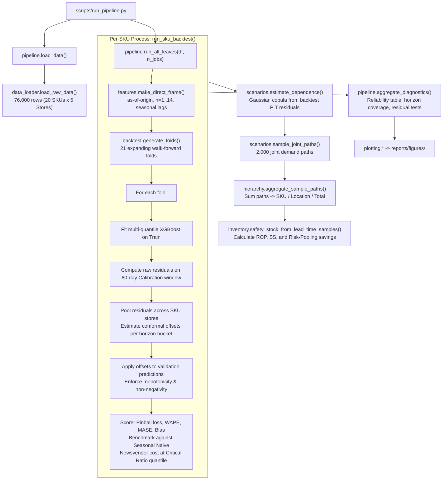
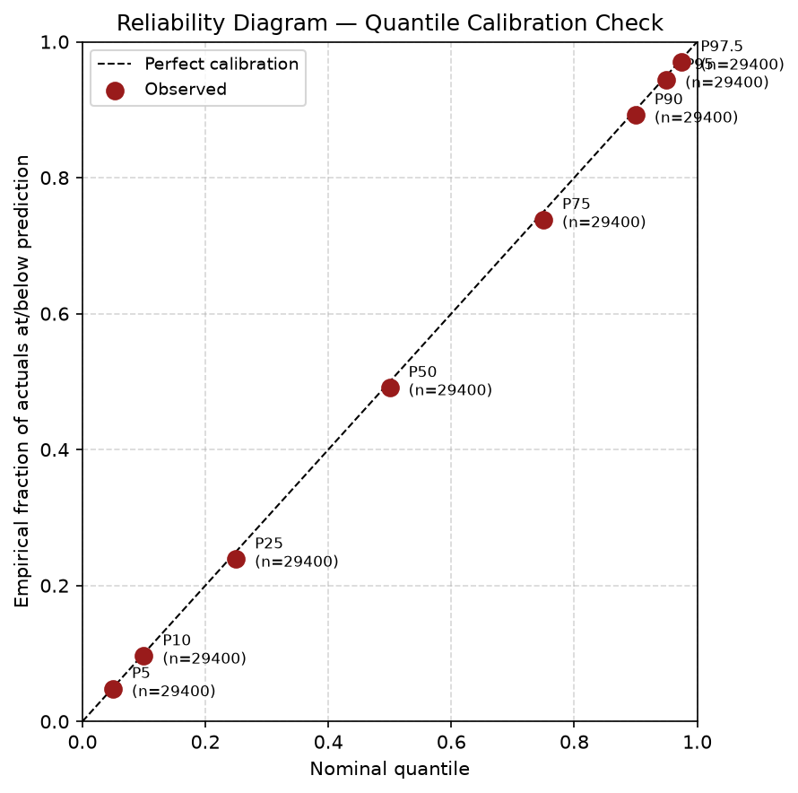
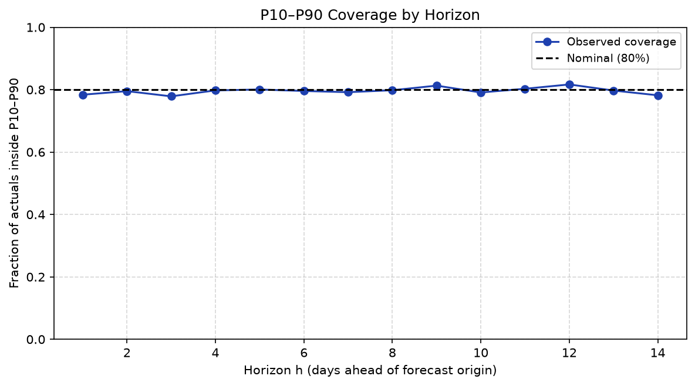
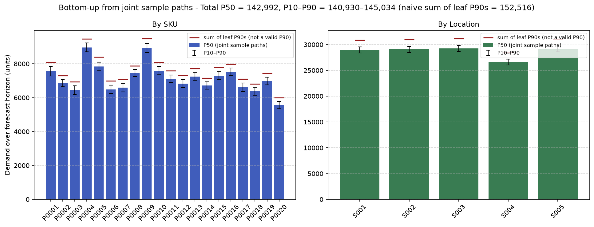
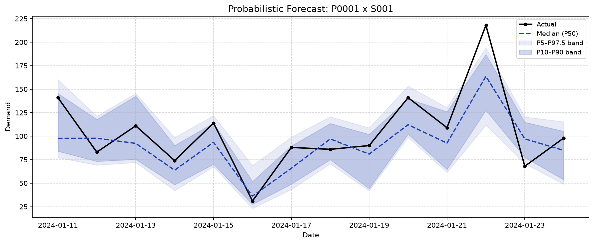
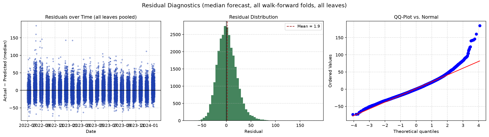
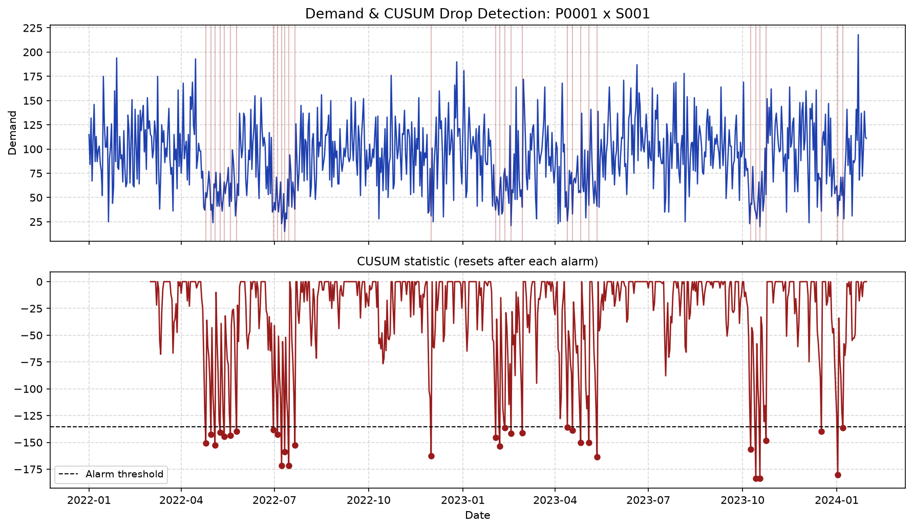

# SKU x Location Stochastic Demand Forecasting

Most forecasting demos stop at "here's my MAE." This one answers
the questions that actually matter once you're planning inventory:
how much safety buffer do I need, where are things breaking down, how
do aggregate forecasts capture risk pooling, and can I trust the
uncertainty range the model is giving me — or is it just made up?

The pipeline forecasts demand per **SKU x Location** (not one big
aggregate series), reconciles those forecasts up to SKU-level,
Location-level, and Total views via **joint sample paths**, and produces
calibrated **P05 through P97.5** quantiles — because a reorder point
is a question about the lead-time distribution, not a point estimate.

## The approach, in depth

### 1. Direct multi-horizon forecasting (leakage-free)
Standard time-series feature engineering often computes rolling means and
lags across the entire series, then slices folds by date. Over a 14-day
horizon, that silently leaks: for day 10 of the horizon, `lag_7` is demand
from day 3 of that *same* forecast horizon, which has not occurred yet.

Here, every training and validation record is an `(origin, horizon h)` pair:
- `origin` is the last known day before the forecast window.
- Features only see observations on or before `origin` (as-of-origin).
- Lags are strictly seasonal (`seasonal_lag_1` is the same weekday observed
  on or before origin). Target-day `price` and `promotion` are treated as
  planned exogenous variables.
- Horizon $h \in [1, 14]$ is fed directly into a multi-quantile XGBoost model.

### 2. Multi-quantile XGBoost + Conformal Calibration
- **Trained quantile set:** `[0.05, 0.10, 0.25, 0.50, 0.75, 0.90, 0.95, 0.975]`.
  Having P95 and P97.5 directly trained avoids having to extrapolate safety
  stocks from P90 under an assumed normal distribution.
- **Split conformal calibration:** The trailing 60 days before each validation
  fold are carved out for calibration. Residuals are pooled across all store
  locations of the same SKU to ensure high sample size, and offsets are
  stratified by horizon buckets ($h \in [1, 7]$ vs. $h \in [8, 14]$) to
  account for uncertainty growing with lead time.

### 3. Sample-based reconciliation & Risk Pooling (Copula)
**Quantiles are non-additive:** $\text{P90}(A + B) \neq \text{P90}(A) + \text{P90}(B)$.
Adding leaf quantiles assumes perfect correlation ($\rho = 1$), which grossly
overstates aggregate uncertainty and destroys the **risk-pooling benefit**
(the core reason centralized inventory requires less safety stock than decentralized stores).

Instead, the pipeline:
1. Maps leaf quantile forecasts into continuous marginal distributions via
   monotone piecewise-linear quantile curves.
2. Models cross-leaf and cross-horizon error dependence using a **Gaussian copula**
   fitted on backtest PIT residuals (with covariance shrinkage).
3. Generates 2,000 joint demand paths. Summing sample paths yields coherent,
   risk-pooled distributions for SKU, Location, and Total levels.

### 4. Margin-based Newsvendor Inventory Model
- **Stockout cost ($C_u$):** Defined as `Gross Margin (30%) × Price`. A lost
  sale forfeits gross profit, not the entire retail revenue (the cost of goods
  sold is not incurred).
- **Holding cost ($C_o$):** 25% annual holding rate prorated over the ordering
  review cycle (7 days): $C_o = 0.25 \times \text{Price} \times \frac{7}{365}$.
- **Decision-aligned evaluation:** The critical ratio $\frac{C_u}{C_u + C_o} \approx 0.975$.
  Evaluating inventory performance at P50 is misleading; the pipeline evaluates
  newsvendor cost at the optimal critical-ratio quantile.
- **Lead-time demand & Safety Stock:** Safety stock is calculated directly from
  simulated lead-time demand samples $D_{LT}$ (supporting stochastic lead time),
  where $\text{ROP} = \text{Quantile}(D_{LT}, \text{SL})$ and
  $\text{SS} = \text{ROP} - \mathbb{E}[D_{LT}]$.

### 5. CUSUM Drop Detection
Cumulative Sum (CUSUM) control chart on each leaf series to detect persistent,
creeping demand drops (e.g., cannibalization, quality shifts) that fixed
percentage thresholds miss.

---

## Project Layout

```
.
├── data/
│   ├── raw/sku_location_demand.csv
│   └── README.md                  # schema + data quirks
├── notebooks/01_hierarchy_eda.ipynb
├── src/
│   ├── config.py                  # quantiles, horizons, cost parameters
│   ├── data_loader.py
│   ├── features.py                # as-of-origin direct multi-horizon features
│   ├── backtest.py                # walk-forward expanding window folds
│   ├── probabilistic.py           # multi-quantile XGBoost + conformal calibration
│   ├── scenarios.py               # Gaussian copula joint paths & lead-time simulation
│   ├── hierarchy.py               # coherent sample-path aggregation & risk pooling
│   ├── inventory.py               # margin newsvendor cost & lead-time safety stock
│   ├── drop_detection.py          # CUSUM process control chart
│   ├── eval_metrics.py            # WAPE, MASE, Bias, Pinball loss
│   ├── plotting.py                # diagnostic figures & calibration plots
│   └── pipeline.py                # orchestrates backtest, diagnostics & scenarios
├── scripts/run_pipeline.py        # CLI runner with multiprocessing support
└── tests/
    ├── test_hierarchy_drops_inventory.py
    └── test_leakage_and_scenarios.py
```

---

## How the Pipeline Runs


```mermaid
flowchart TD
    A["scripts/run_pipeline.py"] --> B["pipeline.load_data()"]
    B --> C["data_loader.load_raw_data()<br/>76,000 rows (20 SKUs x 5 Stores)"]
    A --> D["pipeline.run_all_leaves(df, n_jobs)"]

    subgraph BACKTEST ["Per-SKU Process: run_sku_backtest()"]
        D --> F["features.make_direct_frame()<br/>as-of-origin, h=1..14, seasonal lags"]
        F --> G["backtest.generate_folds()<br/>21 expanding walk-forward folds"]
        G --> H["For each fold:"]
        H --> I["Fit multi-quantile XGBoost on Train"]
        I --> J["Compute raw residuals on 60-day Calibration window"]
        J --> K["Pool residuals across SKU stores<br/>Estimate conformal offsets per horizon bucket"]
        K --> L["Apply offsets to validation predictions<br/>Enforce monotonicity & non-negativity"]
        L --> M["Score: Pinball loss, WAPE, MASE, Bias<br/>Benchmark against Seasonal Naive<br/>Newsvendor cost at Critical Ratio quantile"]
    end

    BACKTEST --> N["scenarios.estimate_dependence()<br/>Gaussian copula from backtest PIT residuals"]
    N --> O["scenarios.sample_joint_paths()<br/>2,000 joint demand paths"]
    O --> P["hierarchy.aggregate_sample_paths()<br/>Sum paths -> SKU / Location / Total"]
    P --> Q["inventory.safety_stock_from_lead_time_samples()<br/>Calculate ROP, SS, and Risk-Pooling savings"]
    BACKTEST --> R["pipeline.aggregate_diagnostics()<br/>Reliability table, horizon coverage, residual tests"]
    R --> S["plotting.* -> reports/figures/"]
```

---

## Quickstart

```bash
# Set up environment
python -m venv .venv
# On Windows: .venv\Scripts\activate
# On Linux/macOS: source .venv/bin/activate

pip install -r requirements.txt

# Run unit tests
pytest -q

# Run full portfolio pipeline (100 leaves, parallelized across CPU cores)
python scripts/run_pipeline.py --n-jobs 8

# Test with stochastic lead time (mean 7 days, std 1.5 days) at 95% service level
python scripts/run_pipeline.py --n-jobs 8 --lead-time 7 --lead-time-std 1.5 --service-level 0.95
```

---

## Empirical Benchmark & Backtest Results

Full portfolio backtest across **20 SKUs × 5 Stores = 100 series**, evaluated over **21 walk-forward folds** (29,400 out-of-sample forecast instances):

### 1. Portfolio Forecast Accuracy vs. Benchmark
Evaluated on point forecasts (P50 median) against the standard industry benchmark (Seasonal Naive — same weekday last week):

| Model | WAPE | MASE | Bias | Share of Leaves Beating Baseline |
| :--- | :---: | :---: | :---: | :---: |
| **Quantile XGBoost (P50, Calibrated)** | **14.6%** | **0.363** | **-1.8%** | **100.0%** (100 / 100 leaves) |
| **Seasonal Naive Benchmark** | 42.2% | 1.036 | -1.5% | 0.0% |

- **WAPE reduction:** Error drops from 42.2% to 14.6% (a 65% relative error reduction).
- **MASE = 0.363:** Significantly outperforms seasonal variation ($< 1.0$).
- **Near-zero bias (-1.8%):** Prevents systematic inventory starvation or bloating.

---

### 2. Probabilistic Calibration & Reliability
Does P90 actually mean 90% coverage?

| Nominal Quantile | Empirical Coverage (Observed) | Sample Size ($n$) |
| :---: | :---: | :---: |
| **P05** | **4.8%** | 29,400 |
| **P10** | **9.6%** | 29,400 |
| **P25** | **23.9%** | 29,400 |
| **P50** | **49.1%** | 29,400 |
| **P75** | **73.8%** | 29,400 |
| **P90** | **89.2%** | 29,400 |
| **P95** | **94.4%** | 29,400 |
| **P97.5** | **97.0%** | 29,400 |



Empirical coverage aligns closely with nominal probabilities across all 8 quantiles.

#### Coverage Across Lead Time Horizons ($h = 1 \dots 14$ days)
A model can be well-calibrated on average while falling apart at longer horizons. Stratified calibration offsets maintain nominal 80% coverage (P10–P90 band) consistently across all 14 forecast days:



```
Horizon h:        1    2    3    4    5    6    7    8    9   10   11   12   13   14
P10-P90 Coverage: 78%  80%  78%  80%  80%  80%  79%  80%  81%  79%  80%  82%  80%  78%
```

---

### 3. Risk Pooling & Hierarchy Reconciliation
Summing leaf quantiles directly creates phantom inventory buffering. Joint scenario sampling captures cross-series diversification:

| Aggregate Level | Sum of Leaf P90 | Reconciled P90 (Copula) | Total Decentralized SS | Reconciled Pooled SS | **Risk Pooling Savings** |
| :--- | :---: | :---: | :---: | :---: | :---: |
| **Total (Network)** | 152,516 units | **145,034 units** | 8,621 units | **1,905 units** | **-78.0% safety stock** |
| **Store S001** | 30,850 units | 29,566 units | 1,701 units | 547 units | **-67.8% safety stock** |
| **Store S002** | 30,970 units | 29,598 units | 1,742 units | 505 units | **-71.0% safety stock** |
| **Store S004** | 28,488 units | 27,150 units | 1,735 units | 509 units | **-70.6% safety stock** |



*The red markers highlight the naive sum of leaf P90s. The distance between the red marker and the top whisker illustrates the phantom inventory that naive quantile addition would order.*

---

### 4. Quantile Fan & Decision Output
Example 14-day stochastic forecast band for leaf `P0001 x S001`:



- **Safety stock plan:** For $L = 7$ days at 95% cycle service level:
  $$\text{Expected } D_{LT} = 565.2 \text{ units} \quad | \quad \text{Safety Stock} = 88.8 \text{ units} \quad | \quad \text{Reorder Point} = 654.0 \text{ units}$$
- **Cost optimization:** Daily cost when stocking at the critical-ratio quantile ($CR \approx 0.975$) is consistently lower than stocking at the median ($P50$).

---

### 5. Residual & Process Diagnostics



Pooled residuals have a mean of $1.86$ units (centered near zero). The QQ-plot confirms that empirical residuals have heavier tails than a theoretical Gaussian — confirming why sizing safety stock via empirical lead-time simulation is safer than relying on standard $z \cdot \sigma \sqrt{L}$ normal formulas.



The CUSUM detector continuously monitors leaf demand, firing alerts during sustained negative drift without false alarms during normal volatility.

---

## Assumptions & Real-World Considerations

1. **Known Future Regressors:** Target-day `promotion` and `price` are assumed known at forecast origin (typical for scheduled retail promotions and price lists).
2. **Gross Margin & Holding Rate:** Assumed 30% gross margin and 25% annual inventory holding cost. In production, these should be replaced with SKU-specific margin and storage cost figures from ERP.
3. **Censored Demand:** In the source dataset, `Units Sold` never exceeds inventory on hand (~28% divergence from unconstrained `Demand`). The pipeline models `Demand` directly; if training on POS sales data in production, demand uncensoring (Tobit/Kaplan-Meier) should be applied first.
4. **Independent Lead Times:** Lead times are modeled as independent between replenishment cycles.

---

## License

MIT — see [LICENSE](LICENSE).
